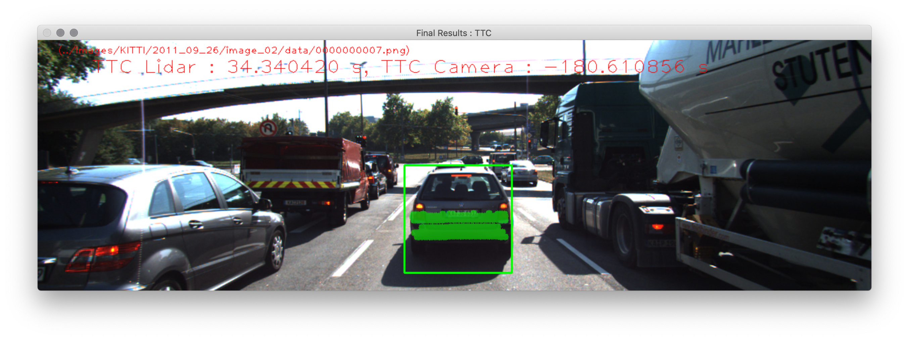

# SFND 3D Object Tracking Final Project Writeup

This writeup provides details of the work corresponding to FP.5 and FP.6 performance evaluation.

## Lidar TTC Estimation
Frame 7 and 10 are identified to have erroneous lidar TTC estimations (>17s), see below.

After debugging, it is found unlikely that these errors are caused by outliers lidar points. The outlier points as seen in the BEV are not used in the `minXPrev` or `minXCurr` calculation and upon inspection, the points on the closest boundary used in the calculation are not the outliers.
Instead, the errors are caused by the break down of the Constant Velocity Model assumption. In the frames with erroneous lidar TTC calculation, the distance (`minXPrev` - `minXCurr`) becomes very small compared to other frames with reasonable TTC estimations. This suggests that the preceding vehicle is "decelerating its deceleration", i.e. accelerating again. The assumption that its velocity at the current frame is the same as the previous frame is therefore incorrect, leading to an erroneous TTC estimation.

## Camera TTC Estimation
The camera TTC comparison between different detector/descriptor pairs is captured in `CameraTTCTable.csv`, two charts are plotted and shown below.

Frames 1/2, 2/3, 3/4, 5/6, 8/9, 12/13, 18/19 do not have a TTC estimation. As a previous operation in the code removes lidar points outside of the ego lane, it is speculated that the matched bounding boxes in these frames are those with lidar points removed, hence the TTC computation loop cannot be entered and thus no TTC was computed.

Many of the TTC estimations result in negative or -inf values. This is due to the assumption in the Constant Velocity Model that the preceding vehicle is moving towards the ego car at constant speed. But in fact, sometimes the preceding vehicle is moving away as it is accelerating so the TTC results in a negative value. Or when there isn't any notable change in distance between keypoints, i.e. distance ratio = 1, the TTC results in a -inf value.

It is found that the AKAZE detectors combined with any descriptors generally give better results of TTC estimations, with no negative or -inf values. These TTC vary from 8s-17s relatively steadily and shows a decreasing trend as expected.
